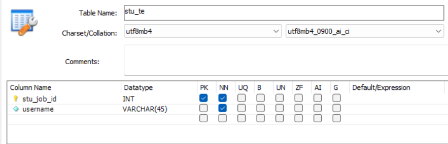
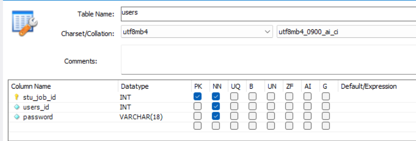

## 使用方法
先创建一个“nodejs”的数据库  
创建三张表，users,stu_te,result
  
  
  
使用vs code打开项目，右键有router.js文件的JS文件夹,选择在集成终端中打开，  
执行下面的操作  
1.安装node.js  
2.安装依赖  
 npm i  
3.运行服务  
 node index.js 回车  
然后打开浏览器访问：http://localhost